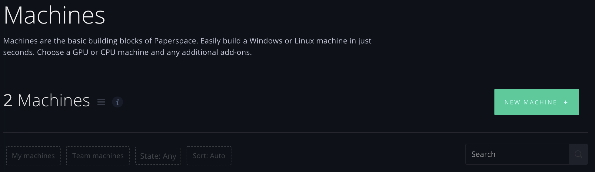
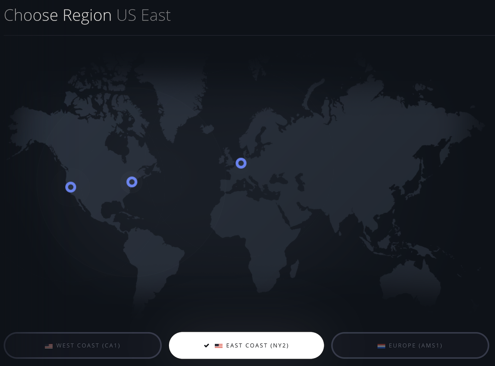
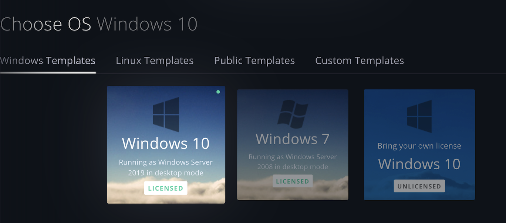
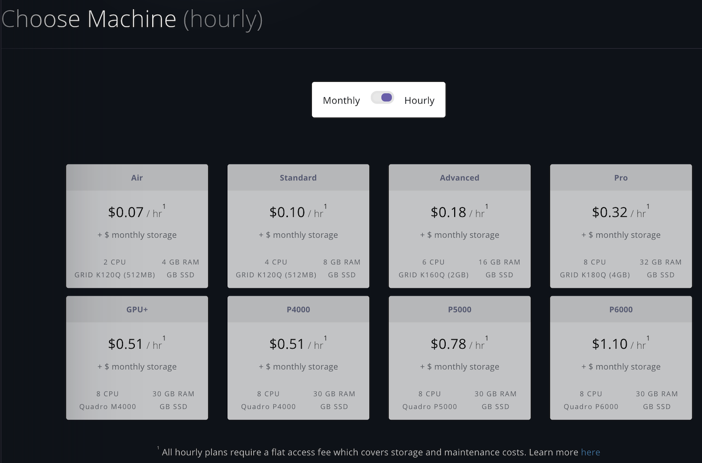
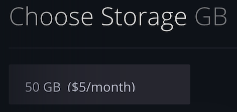
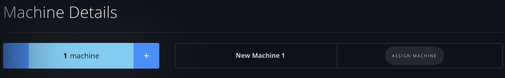
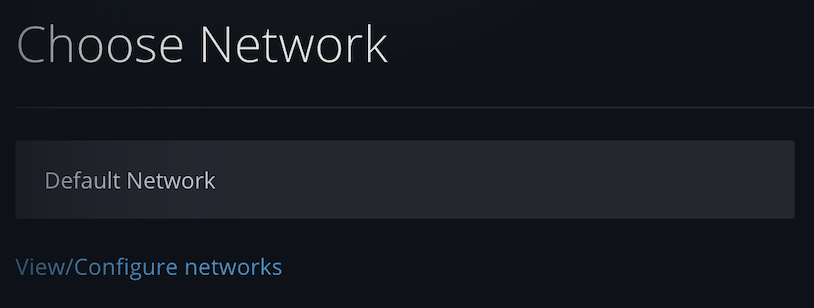
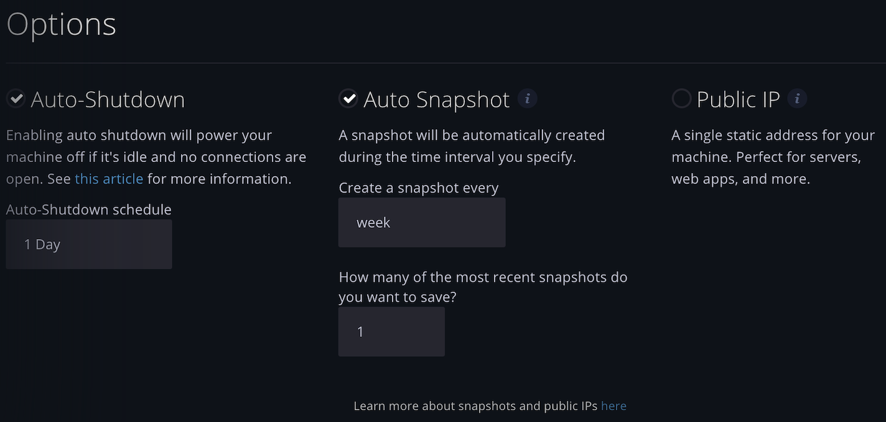
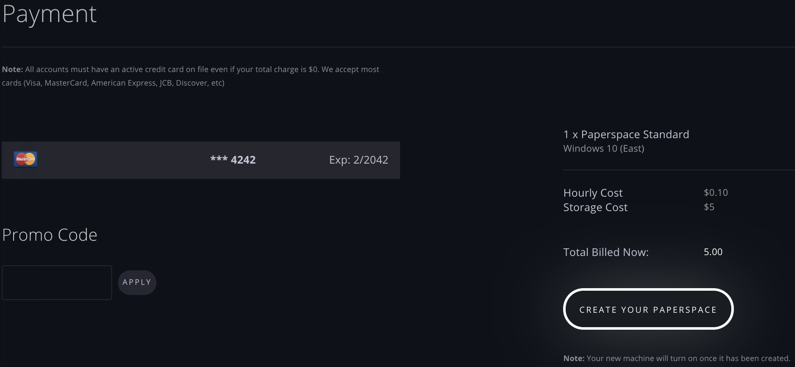

# Create a Machine via the GUI

The steps below describe how to Create a new Machine via the GUI.

Navigate to the Machines page and click "New Machine +" at the top-right:

This will take you to the Machine Create page.

There, select the Region where you want your Machine to reside:

Choose the OS for your Machine:

Toggle whether you want your Machine to bill hourly or monthly, and select your Machine type depending on your desired CPU or GPU:

Select the amount of Storage you want:

You can then specify how many of these Machines you want to create, and type in a name for each of them by clicking the input field that says `New Machine 1` below, for example.

Note that you can also click "Assign Machine" to assign that machine to a particular user on your team, if you are on a team:

Then choose a Network if desired:

Toggle whether you want Auto-Shutdown, Auto Snapshot, and Public IP.

If Auto-Snapshot is enabled, then select the period of time after which auto-shutdown should occur. This is useful, for example, in order to avoid being billed for machine time that you aren't using your Machine but may have forgotten to turn it off.

If Auto Snapshot is enabled, then select the frequency at which you want a snapshot of your Machine to be created and persisted. This is useful in order to ensure that you have a regular backup of your Machine.

If Public IP is enabled, your Machine will be assigned a single static address. This is useful, for example, if you are using your Machine as a persistent server or for a web app.

Finally, click Create Your Paperspace to create your Machine. You will see the amount you'll initially be billed \(for Storage\) as well as the ongoing hourly or monthly cost for the Machine. You can also apply any Promo Code and verify your credit card information before doing so.

Et voilà! Your Machine will spin up in the background, and you'll see it appear back on the Machines list page.

