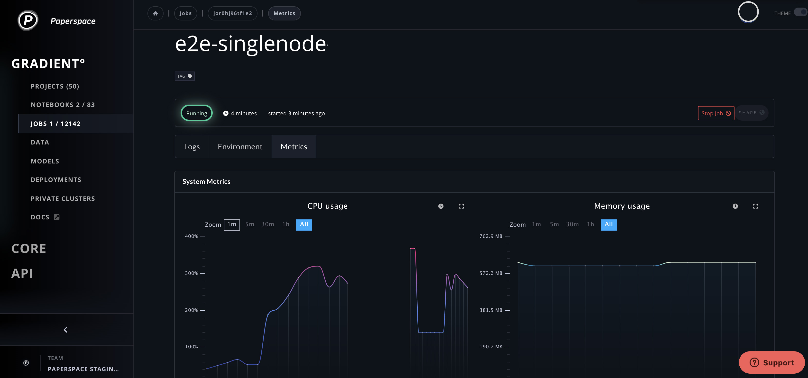

# Metrics Overview

Gradient workloads can record metrics that are available both in realtime or after the workload is complete. Gradient will display these metrics in the web UI and they can also be queried or streamed in the CLI.

Gradient can log three different kinds of metrics: hardware metrics, framework metrics, and custom user metrics.


**Note:** Framework and custom metrics are only available in a Gradient [Private Cluster](../../gradient-private-cloud/about/). [Contact Sales](https://info.paperspace.com/contact-sales) for inquiries!


## System metrics

All Gradient workloads like Experiments and Deployments monitor and track CPU, Memory, and Network. If the machine is equipped with a GPU, this will be tracked as well.



## Framework metrics

For example, accuracy and mean squared errors are two common metrics for classification and regression, respectively.

If your deployment uses TF Serving, some metrics such as`tensorflow:core:direct_session_runs`, `tensorflow:cc:saved_model:load_attempt_count` etc. will be logged automatically.

## **Custom metrics**

You can log custom user metrics from inside of an experiment or deployment using the Python CLI utils. It's based on [Prometheus Python Client](https://github.com/prometheus/client_python). Here's a trivial example:  


```python
from gradient_utils.metrics import 

logger = MetricsLogger(grouping_key={'ProjectA': 'SomeLabel'})

logger.add_gauge("Gauge")
logger.add_counter("Counter")


while datetime.now() <= endAt:
    randNum = randint(1, 100)
    logger["Gauge"] = 5
    logger["Gauge"].set(randNum)
    logger["Counter"].inc()
    logger.push_metrics()
```


