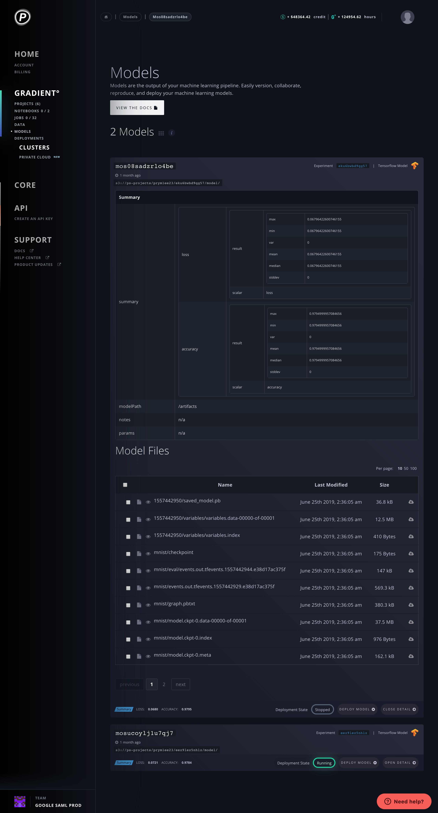

# Create a Model

## Create a Model

To create a Model using the CLI, run an Experiment, such as by [using one of the sample Experiment commands](../experiments/run-experiments-ui.md#h_39323868261524588004147), and set both `--modelPath` and `--modelType` according to those instructions. This will place your Model in your [Model Repository](about.md#model-repository).

## View Your Model Repository

You can view your Models in your Model Repository in the GUI or in the CLI, as seen below.

### In the GUI

You can view your Models in your Model Repository in the GUI by clicking Models in the menu.

As you can see, the GUI view shows your Model ID, when the model was created, the S3 bucket location of your model, your metrics summary data, the Experiment ID, the model type, and whether it is currently deployed on Paperspace.

You can click "Deploy Model" to [Create a Deployment](../deployments/create-a-deployment.md#create-a-deployment) with your Model. And you can click "Open Detail" to see a more detailed view of the Model's performance against your metrics This will also show a list of all of the checkpoint files \(artifacts\) generated by the Experiment, including the final Model at hand, as well as to download any of those files.

### In the CLI

Alternately, you can view your Models – albeit currently with less detailed data – via the CLI by running `gradient models list`.

#### Parameters

The following parameters can be used with the `list` subcommand:

| Argument | Description |
| :--- | :--- |
| `--experimentId` | Filter models list by experiment ID |
| `--projectId` | Filter models list by project ID |

_Note: `list` is currently the only `models` subcommand in the Gradient CLI._

