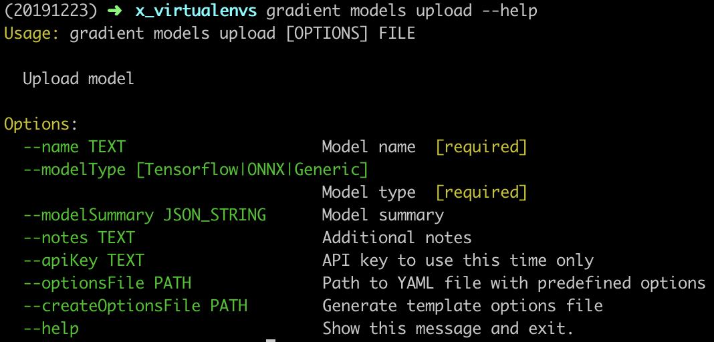
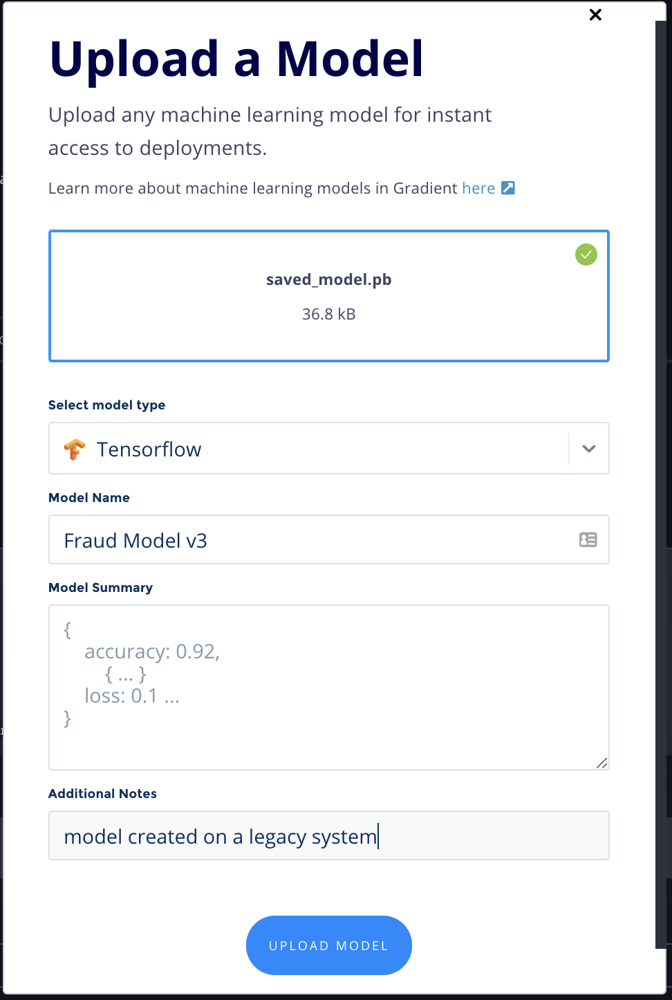
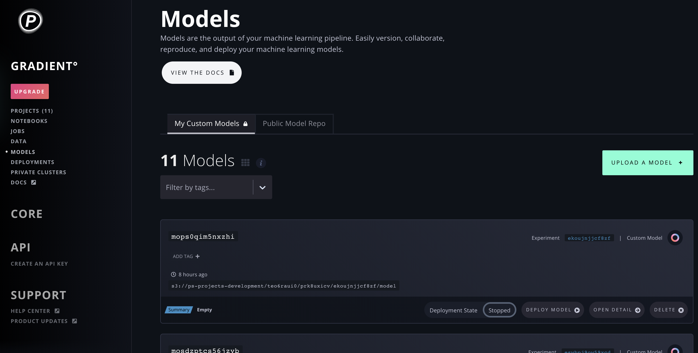
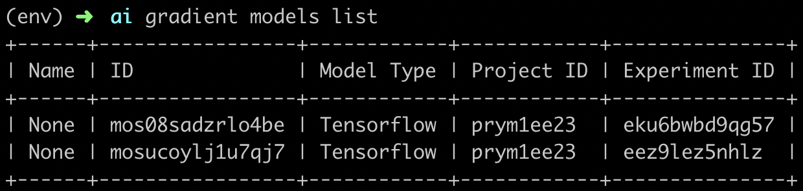

# Create a Model

## Create a Model

There are two ways to create a Model in Gradient, and both can be done via the GUI or CLI:

#### 1\) Run an Experiment that generates a Model

You can do this [via the GUI](../experiments/run-experiments-ui.md) or [via the CLI](../experiments/run-experiments-cli.md) by [using one of the sample Experiment commands](../experiments/run-experiments-ui.md#h_39323868261524588004147); be sure to set both `--modelPath` and `--modelType` according to those instructions. This will place your Model in your Project's [Model Repository](about.md#model-repository).

#### 2\) Upload a Model

You can upload a Model via the CLI with the `gradient models upload` subcommand:

To upload a Model via via the GUI, first navigate to the **Models** page.

From there, click **Upload a Model +**:

This will open up a modal to **Upload a Model**, where you can drag 'n drop a Model from your local machine \(or click to find it locally\), as well as select the model **Type** and provide a **Name**, custom **Summary**, and any **Additional Notes** as metadata:

Then click **Upload Model**. This will create the Model in Gradient and persist it to S3.

Whether you use the GUI or CLI, you've now successfully uploaded a Model into Gradient!

_Note: Uploaded Models will not be associated with an Experiment._

Now that you have a Model, whether uploaded or generated by running an Experiment, read on to learn how you can use it to create a Deployment.

## View Models in Your Model Repository

You can view your team's Models in your Model Repository via the GUI or CLI, as seen below.

### In the GUI

Navigate to **Models** in the side nav to see your list of trained Models:

As you can see, the GUI view shows your Model ID, when the model was created, the S3 bucket location of your model, your metrics summary data, the Experiment ID, the model type, and whether it is currently deployed on Paperspace.

You can click **Deploy Model** to [Create a Deployment](../deployments/create-a-deployment-ui.md#create-a-deployment) with your Model. And you can click **Open Detail** to see a more detailed view of the Model's performance metrics. This will also show a list of all of the checkpoint files \(artifacts\) generated by the Experiment, as well as the final Model at hand, and you can download any of those files.

### Upload a Model

### In the CLI

Alternately, you can view your Models \(currently with less detailed info\) via the CLI by running `gradient models list`.

#### Parameters

The following parameters can be used with the `list` subcommand:

| Argument | Description |
| :--- | :--- |
| `--experimentId` | Filter models list by Experiment ID |
| `--projectId` | Filter models list by Project ID |

