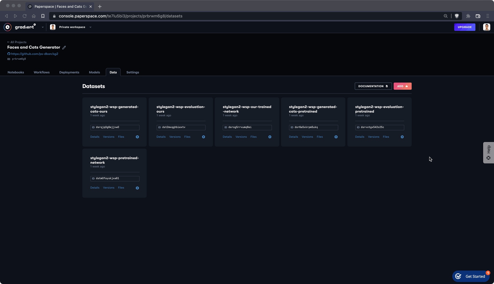

# Storage Billing

Gradient provides two types of storage: [Volume](notebooks-storage.md#volume) storage and [Bucket](notebooks-storage.md#bucket) storage. The delineation refers to whether the data is available online or offline and helps users pay only for what they use.&#x20;

With volume storage, data is available only while running a Gradient Resource such as a notebook or workflow. With bucket storage, data is available for online or offline viewing.

## Storage Uses **and Billing**

### **Volume** storage

Volumes are persistent storage resources that provide shared access to a filesystem while the instance is online.

Examples of volume storage include:

* **Gradient Notebooks:** Any information stored in `/storage` and in `/notebooks`
* **Gradient Datasets:** Any dataset cache in Gradient Workflows or Gradient Deployments

For more information about team volumes go to the Storage tab in the Team Settings view which can be found by clicking the user icon in the top right.

### Volume storage billing

The amount of volume storage you have access to is dictated by your Gradient subscription tier as shown below.&#x20;

Any storage over these limits will be charged at $.29/GB/month.&#x20;

These charges are accrued hourly at the current usage of the bucket. For example, if a user goes over the 2GB limit for 3 days then the account will only be charged for the 3 days of usage over the free limit.&#x20;

| Subscription | Volume Storage |
| ------------ | -------------- |
| Free         | 5GB            |
| Pro          | 15GB           |
| Growth       | 50GB           |

****

### **Bucket** storage

Buckets refers to long-term storage which is primarily used for offline viewing of files and dataset versioning.

Examples of bucket storage include:

* **Offline data for Gradient Notebooks:** Files and datasets viewable offline in a notebook. In the offline view, buckets will store `.ipynb` files, `.md` files, any git tracked files, and any files included in the  `.notebookinclude` file. For additional information on how to include files in the offline view in Notebooks, see [Notebook file whitelist](https://docs.paperspace.com/gradient/explore-train-deploy/notebooks/create-a-notebook/notebook-include#upload-all-pngs-but-skip-my-dataset).
* **Versioned Datasets:** Each time a Gradient Dataset is versioned, these iterations of the dataset are stored within a bucket. For more information see [Versioned Data](../../../data/data-overview/private-datasets-repository/).


To avoid getting charged for bucket storage, delete Gradient Notebooks and versioned datasets that may no longer be in use.


### Bucket storage billing

No matter the subscription type all Gradient users receive 2GB free bucket storage.&#x20;

Users who exceed that limit will be charged $0.29/GB/Month.&#x20;

These charges are accrued hourly at the current usage of the bucket. For example, if a user goes over the 2GB limit for 3 days then the account will only be charged for the 3 days of usage over the free limit.&#x20;


If a user does not have a credit card associated with the team then there will be a strict cap at 2GB and could lead to a failed notebook teardown.


