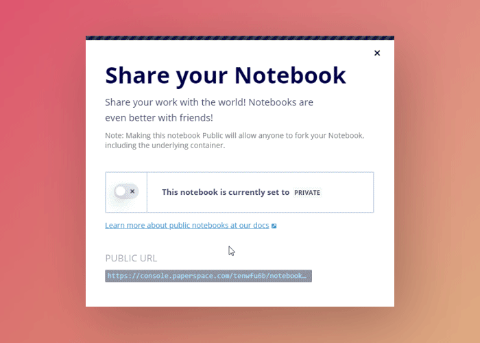

# The Notebook interface

A Gradient Notebook gives you access to a full Jupyter Notebook environment. Within the Notebook, you can store an unlimited number of documents and other files. You can think of a Gradient Notebook as your persistent, on-demand workspace in the cloud. 

### Storing data

Every notebook in your account automatically includes a persistent filesystem. Use this directory to store datasets, model checkpoints, and more.  Learn more [here](../../data/storage.md#persistent-storage). Gradient also includes a [public datasets repository](../../data/public-datasets-repository.md). 

### Offline mode

One of the advantages of using Gradient Notebooks is that you can view their contents without actually running the Notebook. Just click the open button on any public or private Notebook and it will open a static version. This is handy for exploring public Notebooks or just quickly glancing at your work.

### Sharing Notebooks

You can easily generate a link to [share your Notebook](share-a-notebook.md) with friends and colleagues or the general public. Public Notebooks can be forked by others into their own account. To learn more about how Notebooks work, you can fork a public demo Notebook [here](https://console.paperspace.com/ps-dan/notebook/pr3k0bq87).  The [ML Showcase](https://ml-showcase.paperspace.com/) ****includes several working examples of projects you can run with a couple clicks \(project [submissions welcome](https://blog.paperspace.com/write-for-paperspace/)!\)

