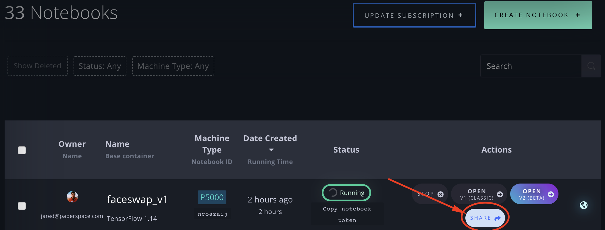
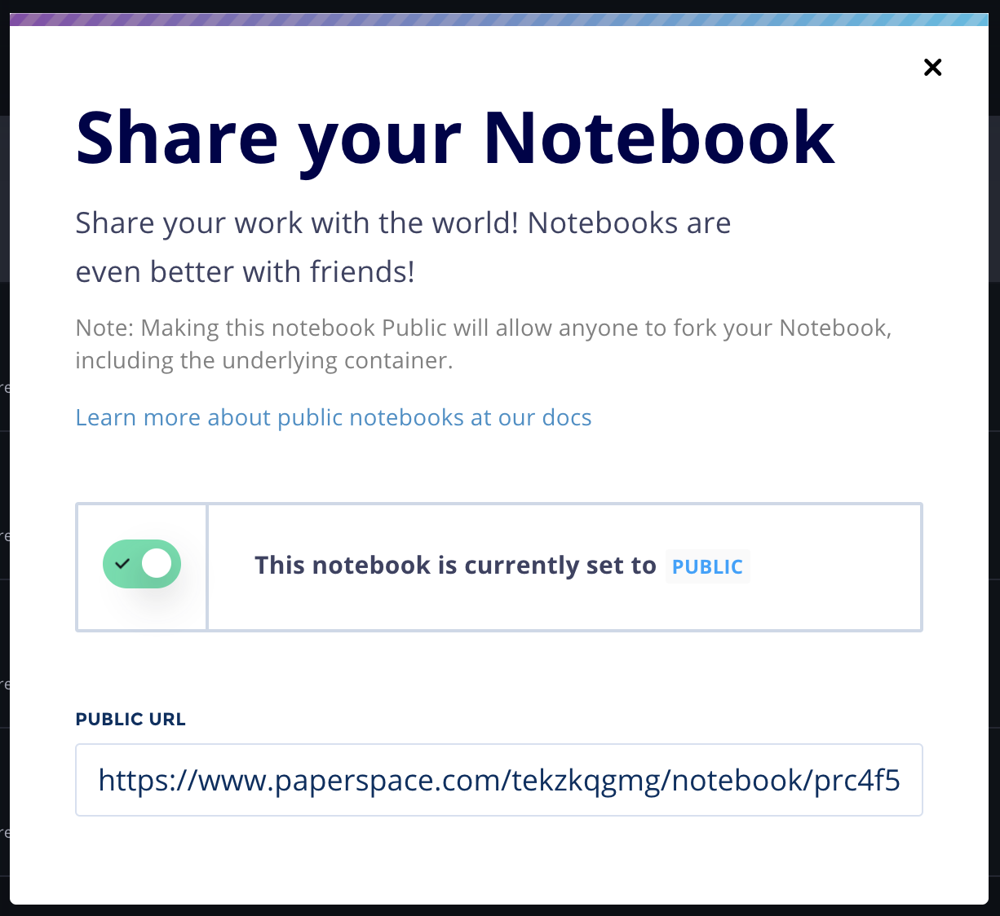

# Community \(Public\) Notebooks

### Beta Release

In early October, 2019, we launched the beta of Gradient Community Notebooks – [register here](https://docs.google.com/forms/d/1VtgyUJxwWo5HQIW_GKZvue_sW9R7PJANa_USdQJ4yaE)!

Gradient Community Notebooks allow you to create, run, and share your Jupyter Notebooks with the world.

The goal is to offer a product that makes it free, easy, and fun to share your work with others, to discover and fork notebooks from other users, and to introduce social features to Gradient. We are working to release Community Notebooks to the general public in the coming weeks!

Gradient Community Notebooks can be viewed by anyone, with or without a Paperspace account.

#### Making a Notebook Public or Private

Navigate to the Notebooks list under the Gradient menu.

Click Share on the Notebook that you wish to make Public.

This will launch the Share Notebook modal, where you can then click the toggle \(pictured green already below\) to make the notebook Public or Private.

#### Public Profiles

With this launch, you can now create a [Public Profile](https://www.paperspace.com/jared) and a user or team handle. This is the start of social features on Gradient!

#### Submitting Your Beta Feedback

During the Beta, we'd love to hear your feedback on Community Notebooks as we work to stabilize and round out the UX of this new product offering. Click the buttons in the Community Notebook app, or directly open and track [feature requests](https://paperspace.canny.io/feature-requests) or [bug reports](https://feedback.canny.io/bug-reports) here!

#### Limitations

Community Notebooks take advantage of the newly released [Free Instances](../instances/free-instances.md) on Gradient. This means that they will be Public-only and will auto-shutdown after 6 hours.

#### Forking Community Notebooks

You can fork any Gradient Community Notebook by clicking the green Play button at the top of that Community Notebook's page. For now, this will fork the notebook into your private workspace. Soon it will allow you to fork into a team of your choice.

_Note: By making your notebook Public, the underlying container will be able to be forked to other users' accounts, including if they are within a private container registry. So, as with anytime you would share a container, be sure not to remove any sensitive data, such as API keys or secrets, before making that notebook Public!_

