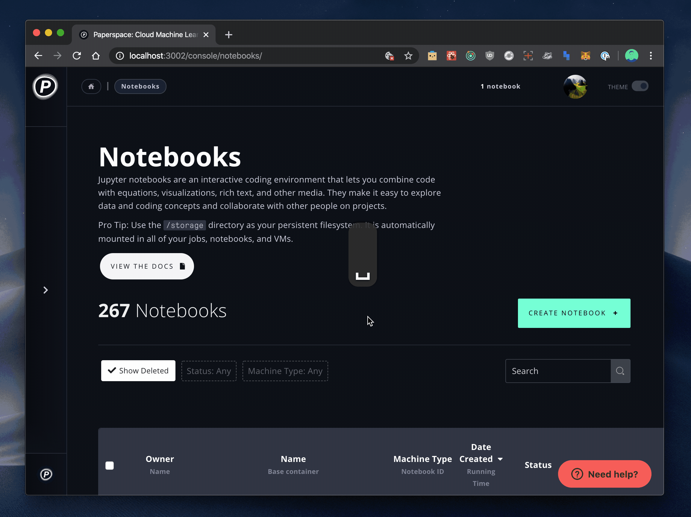

# Hotkeys

## Navigating with hotkeys

Visiting the Paperspace console, you can click your user icon in the top right to display the Hotkeys overview modal.


 Hotkeys are a new feature. If there is a function you would like to add, please don't hesitate to reach out with your suggestions


While viewing an Experiment or a Job, you can also press Shift to view options for navigating to the various tabs available in those views.

