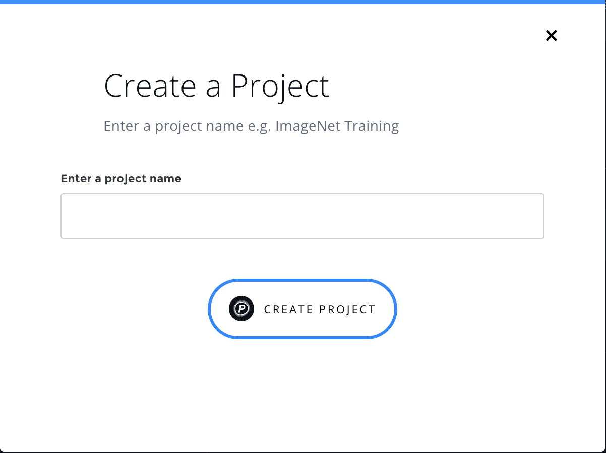

# Create a Project via the GUI

## Create a Standalone Project

On the Projects page, click _Create Project_ and select _Create Standalone Project_.

Provide a name and then click _Create Project_.



## Create a GradientCI Project

[GradientCI](gradientci.md) Projects allow you to connect a GitHub repository to your Project in order to automatically run experiments when you push new commits or open pull requests \(PRs\).

Visit [www.paperspace.com/console/projects](https://www.paperspace.com/console/projects), click _Create Project_, and select **Create GradientCI Project**. Make sure you have installed **GradientCI** on the target repository to which you'll link your Project.


If you haven't yet connected your GitHub account, follow the prompts to grant access to your GitHub repositories and to your GradientCI App installation:


Then, select the GitHub repo from the dropdown list:


## Get Your Project's ID

When using the CLI, or for collaboration or reference, it can be useful to specify a Project's ID.

Click any Project in the Projects List to navigate to its Project Details page, and then click the Project ID to copy the value to your clipboard:


From the CLI, you can also enter the following command:

```bash
gradient projects list
```

