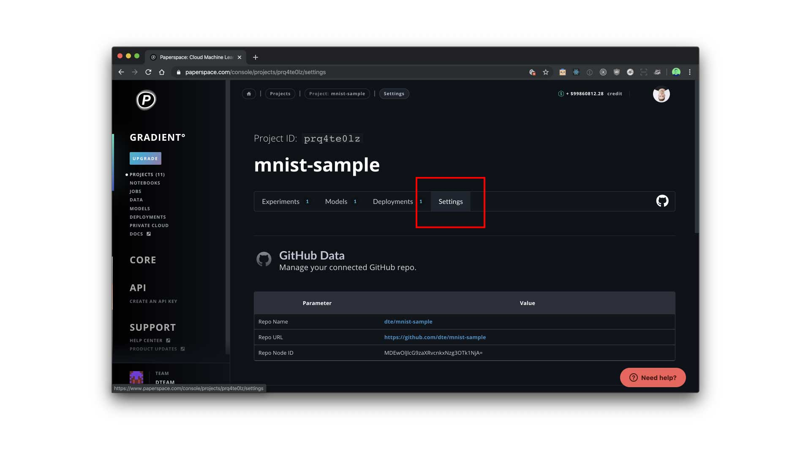
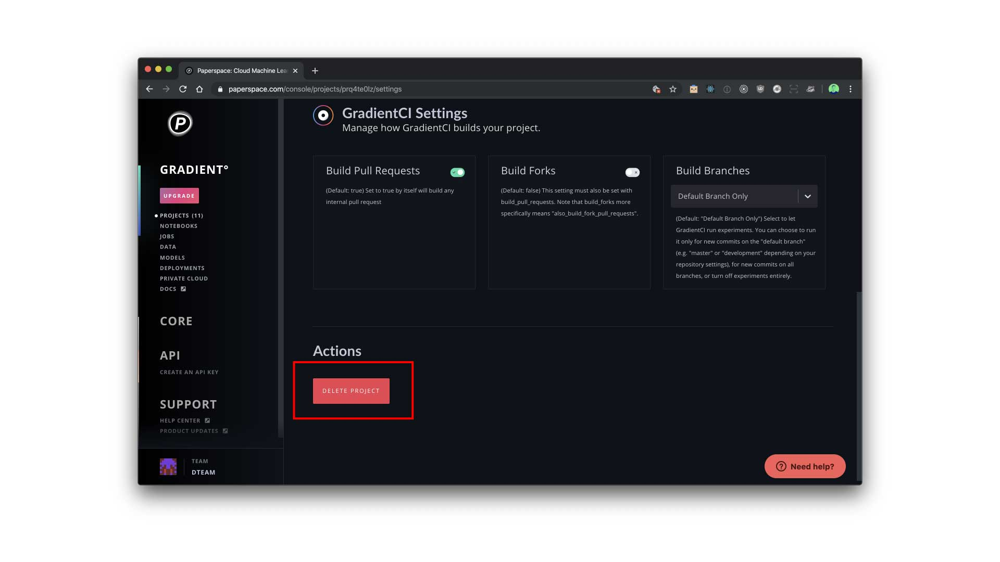

# Deleting a Project

You can delete a project by visiting the project's `Settings` page and hitting the `Delete Project` button.  

### In the UI





### In the CLI

```bash
gradient projects delete --id <project id>
```

