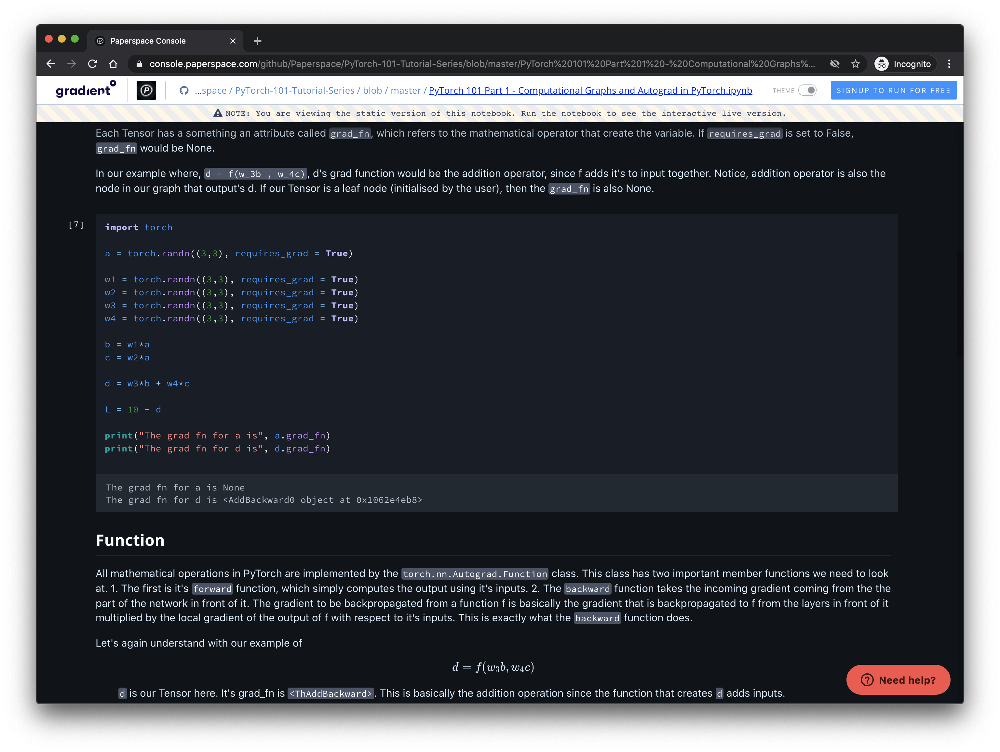
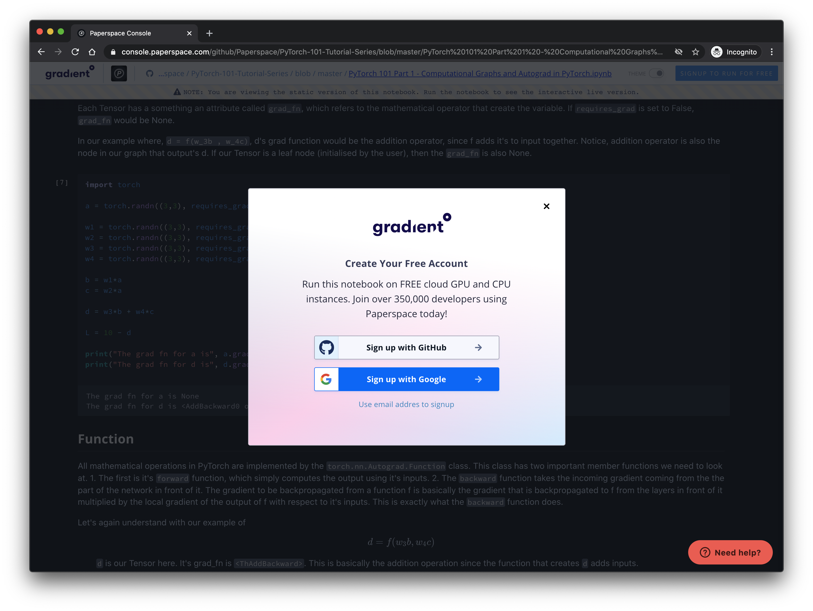

# GitHub Badge - Run on Gradient


## How it Works

The "Run on Gradient" badge allows you to run a Gradient Notebook from any GitHub repository.





## Using the "Run on Gradient" badge

Simply add the following code snippet to your `Readme.md` on your public GitHub repo:

```text
[](https://console.paperspace.com/github/huggingface/nlp/blob/master/notebooks/Overview.ipynb)
```

Notes:

**Workspace**: When you launch a new notebook from this button, you will pull in the individual `.ipynb` file \(specified in the snippet above\) as a workspace.  Optionally, if you would like to pull in the entire cloned GitHub repo as a workspace, append a `?clone=true` query parameter.

**Runtime:** You can also optionally specify a Docker container to run this workspace in.  You can point to any public container by appending `?runtime=paperspace/fastai` where you replace `paperspace/fastai` with your container name.

### Does this work with private GitHub repos?

Currently the 1-click "launch on gradient" button will only work with public GitHub repositories. If you would like to use a private GitHub repository or a container that is in a private registry, you can do so by clicking "Change instance type \(advanced\)" before running the notebook \(or alternatively, visiting the "Create Notebook" page in the Paperspace Console. 

### Where can I find the "Run on Gradient" Badge

The badge can be found here: [https://assets.paperspace.io/img/gradient-badge.svg](https://assets.paperspace.io/img/gradient-badge.svg) . 

It looks like this:


