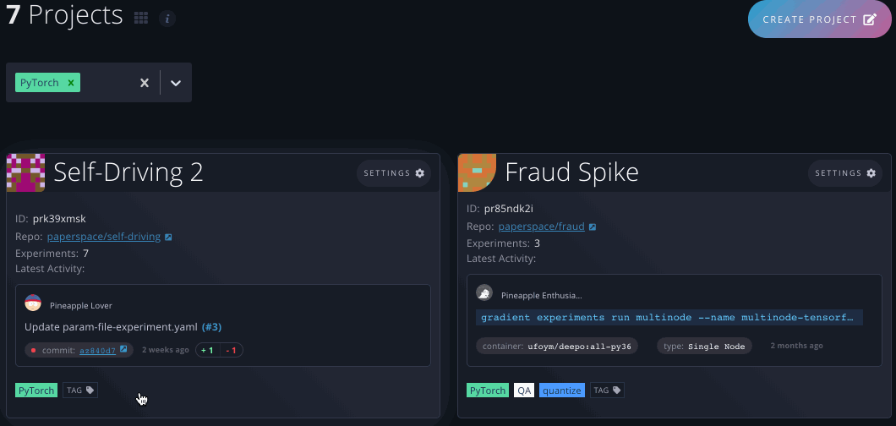
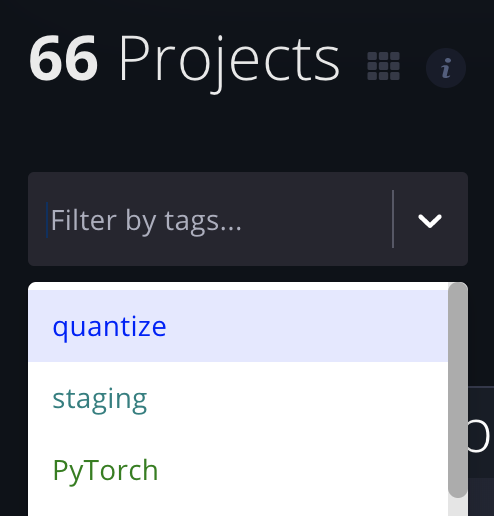

# Using Tags

## Adding, Creating, Removing, and Filtering by Tag

### Adding Tags to Entities

Team admins can add new and existing tags to any of their team's entities. Team members can add new and existing tags to entities that they created. Any new tag will become available for use across all of a team's entities.



To add, create, or remove a tag on any taggable entity, click the **Tag** button. This will open the **Edit Tags** modal, where you can: 1\) see any current tags on that entity, 2\) create and add new tags, and 3\) remove current tags. After you've added or removed tags, click **Submit** to finalize your changes.




Entity tags are coming soon to the CLI!



### Filtering Entities by Tag



To find entities with a specific tag, first click the **Filter by tags** dropdown at the top of any entity list. The example below uses Projects.

Type or select tags to filter the entity. This will result in all entities that match the selected tags.

You can also add tags to filter the current entity list by clicking on any tag on any entity.



Entity tags are coming soon to the CLI!



