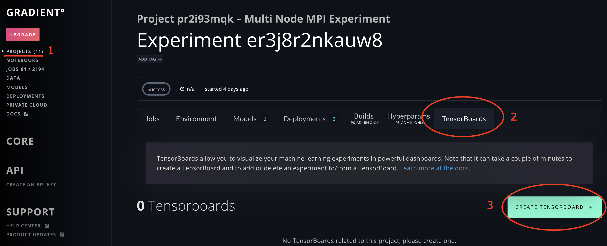
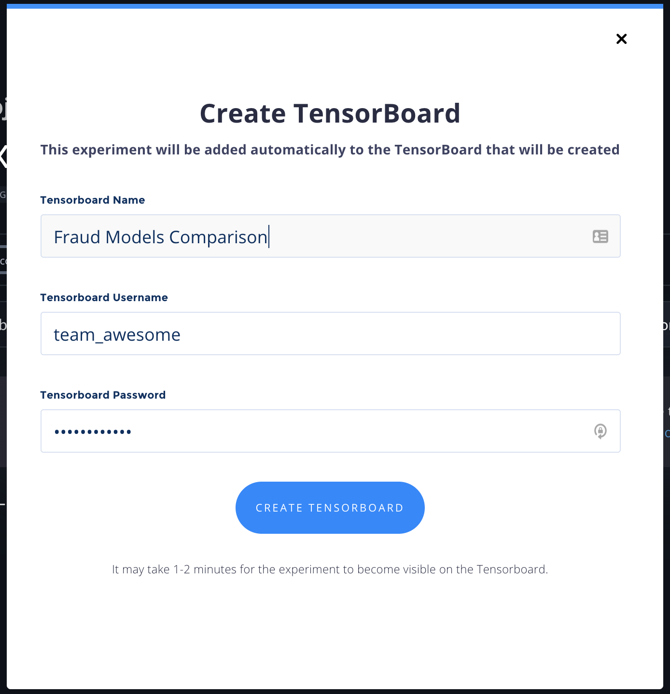
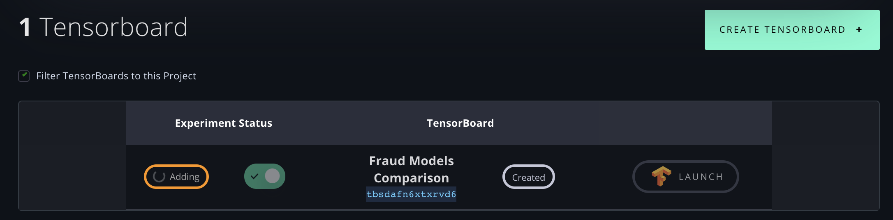
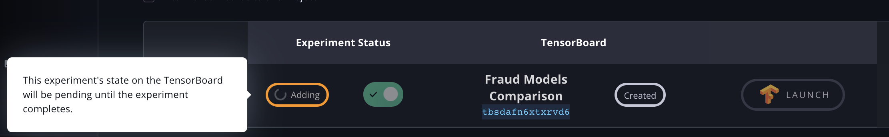
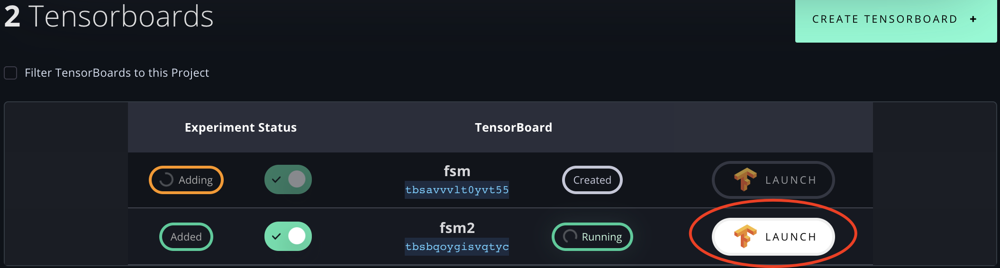
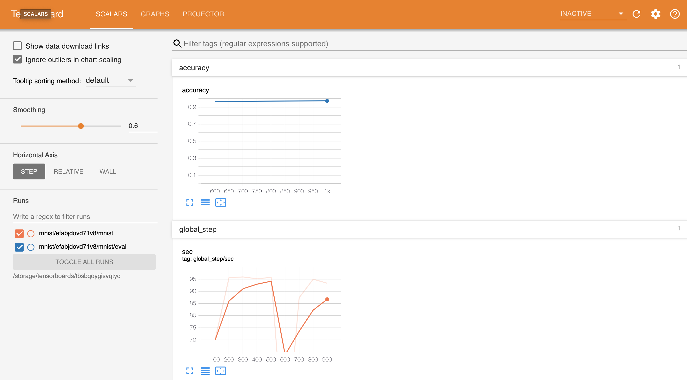

# Using Tensorboards


Gradient TensorBoards require a [Gradient Private Cluster](../../gradient-private-cloud/setup/managed-installation.md)



View the full CLI/SDK Docs for **Tensorboards** here: [https://paperspace.github.io/gradient-cli/gradient.cli.html\#gradient-tensorboards](https://paperspace.github.io/gradient-cli/gradient.cli.html#gradient-tensorboards)


Gradient Private Cluster customers are able to create TensorBoards, as well as attach and remove Experiments to them. You can perform these operations via the web UI or the CLI.

From any Experiment details view, you can add any experiment, across all team projects, to any TensorBoard.

You'll see all of your team's TensorBoards listed under any Experiment Details view, though you can filter TensorBoards down only to show the ones that contain Experiments from within the current Project.

## Create a TensorBoard



To create a TensorBoard, whether your team already has multiple or has none, 1\) navigate to **Projects** and click into any Experiment to see its Details page; 2\) click **TensorBoards**; and 3\) click **Create TensorBoard**.



Clicking **Create TensorBoard** will launch the following modal, where you can add a Name for your TensorBoard, as well as optional Username and Password for basic authentication. Then click **Create TensorBoard**.



By default, if you have zero TensorBoards, the current experiment will be automatically added to your first TensorBoard.

You can then see a mapping between the current Experiment \(the one whose Details page you're working from\) and all TensorBoards, with the **Experiment Status** in relation to each TensorBoard, as well as the **name** and **ID** of each of your team's TensorBoards, and that TensorBoard's status.



Note that although you can technically add an Experiment that has not completed, or that has failed, to a TensorBoard, it will not be complete **Adding** to a given TensorBoard until that Experiment has completed.





You can create a TensorBoard with the following command:

```text
gradient tensorboards create
```

**Options:**

```text
Usage: gradient tensorboards create [OPTIONS]

    Create new tensorboard

Options:
  --experiment TEXT         IDs of experiments  [required]
  --image TEXT              Image
  --username TEXT           Username
  --password TEXT           Password
  --apiKey TEXT             API key to use this time only
  --optionsFile PATH        Path to YAML file with predefined options
  --createOptionsFile PATH  Generate template options file
  --help                    Show this message and exit.
```



## Viewing a TensorBoard

If a TensorBoard has had Experiments added to it, simply click Launch to open the TensorBoard in order to view the resultant TensorBoard and experiment visualizations:



Here's a TensorBoard showing the Experiment that I added above, which is displaying a model from a simple MNIST sample experiment:



## Adding and Removing Experiments



You can manually **Add** or **Remove** an experiment from a TensorBoard by clicking the green toggle under Experiment Status. In other words, if you wish to _add_ an Experiment to a TensorBoard \(thus including it on that TensorBoard\), click the Experiment Status toggle to be active / green / to the right.To _remove_ an Experiment from a TensorBoard, click the toggle to be inactive / gray / to the left.


As noted above, you can re-add an Experiment to a TensorBoard simply by toggling the Experiment Status back to active / green / to the right.


Note that because TensorBoards spin up on dedicated CPU-only machine instances, and Experiments must have completed checkpoints in order to be added to TensorBoards, the Create, Add, and Remove operations can take time.


And that's it! Stay tuned for further iteration as we continue to make TensorBoards an even more powerful feature.



### Adding Experiments to a existing tensorboard

```text
gradient tensorboards add-experiments
```

**Options:**

```text
Usage: gradient tensorboards add-experiments [OPTIONS]

  Update tensorboard experiments

Options:
  --id TEXT                 Tensorboard ID  [required]
  --experiment TEXT         IDs of experiments  [required]
  --apiKey TEXT             API key to use this time only
  --optionsFile PATH        Path to YAML file with predefined options
  --createOptionsFile PATH  Generate template options file
  --help                    Show this message and exit.
```

### Removing Experiments from a tensorboard

```text
gradient tensorboards remove-experiments
```

**Options:**

```text
Usage: gradient tensorboards remove-experiments [OPTIONS]

  Update tensorboard experiments

Options:
  --id TEXT                 Tensorboard ID  [required]
  --experiment TEXT         IDs of experiments  [required]
  --apiKey TEXT             API key to use this time only
  --optionsFile PATH        Path to YAML file with predefined options
  --createOptionsFile PATH  Generate template options file
  --help                    Show this message and exit.
```



## Delete Tensorboard

You can delete a TensorBoard instance via the CLI, as follows.



To delete a TensorBoard, run the following command:

```text
gradient tensorboards delete --id <tensorboard-id>
```

**Options:**

```text
Usage: gradient tensorboards delete [OPTIONS]

  Delete tensorboard

Options:
  --id <tensorboard ID>     Tensorboard ID  [required]
  --apiKey TEXT             API key to use this time only
  --optionsFile PATH        Path to YAML file with predefined options
  --createOptionsFile PATH  Generate template options file
  --help                    Show this message and exit.
```



## Learn More

You can also use TensorBoards via the CLI, as well as by [scripting them within a TensorFlow script](getting-started-with-tensorboards.md).

