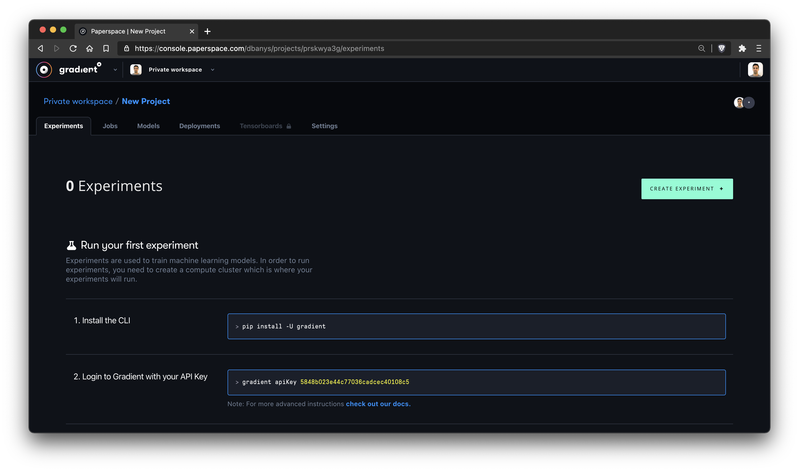

# Train a Model with the Web UI

### **Objectives**

* Explore Gradient Projects
* Learn the workflow involved in training a model
* Use custom containers with jobs
* Create an Experiment that trains a Scikit-learn model
* Share files and models across jobs

## **Introduction**

In this tutorial, we’ll show you how to train a linear regression model to predict the salary of a software engineer depending on their experience. The dataset is partially based on the [Stack Overflow salary calculator](https://stackoverflow.com/company/salary), which we’ll use to build a single variate linear regression model with one feature \(experience\) and label \(salary\).

The Experiment generates a Python pickle file that gets stored in the shared storage service of Gradient.

## **Create a Project and an Experiment for Training the model**

After signing in, click on Gradient in the navigation bar on the left to choose Projects. Click on the Create Project button and select Create Standalone Project. Enter a name for the project when prompted.


## Creating the Experiment

Within this project, we will create an experiment that trains the model.



Experiment Builder is a wizard-style UI tool to submit a job.

The first step is to choose a machine type for scheduling the Experiment. Gradient takes advantage of Google Compute Engine’s preemptible instances to provide low-cost infrastructure. Make sure you check  **Enable low-cost instances**. Choose G1 machine type that comes with 1 CPU core, 1.7GB RAM, and 250GB SDD. This configuration is sufficient for the Scikit-learn training job. For TensorFlow and PyTorch, you can select a GPU-based machine type for accelerating the job.


In Gradient, Experiments are based on a container image that provides the runtime and dependencies. For this tutorial, we are using an image that contains Python 3 runtime with Scikit-learn framework.


On a side note, if you want to use your own container image, feel free to use or modify the Dockerfile and push it to a public container registry such as Docker Hub.

```bash
FROM alpine:latest

LABEL MAINTAINER="Janakiram MSV <janakiramm@gmail.com>"

# Linking of locale.h as xlocale.h
# This is done to ensure successfull install of python numpy package
# see https://forum.alpinelinux.org/comment/690#comment-690 for more information.

WORKDIR /var/www/

ENV PACKAGES="\
    dumb-init \
    musl \
    libc6-compat \
    linux-headers \
    build-base \
    bash \
    git \
    ca-certificates \
    freetype \
    libgfortran \
    libgcc \
    libstdc++ \
    openblas \
    tcl \
    tk \
    libssl1.0 \
    "

ENV PYTHON_PACKAGES="\
    numpy \
    matplotlib \
    scipy \
    scikit-learn \
    pandas \
    nltk \
    "

RUN apk add --no-cache --virtual build-dependencies python3 \
    && apk add --virtual build-runtime \
    build-base python3-dev openblas-dev freetype-dev pkgconfig gfortran \
    && ln -s /usr/include/locale.h /usr/include/xlocale.h \
    && python3 -m ensurepip \
    && rm -r /usr/lib/python*/ensurepip \
    && pip3 install --upgrade pip setuptools \
    && ln -sf /usr/bin/python3 /usr/bin/python \
    && ln -sf pip3 /usr/bin/pip \
    && rm -r /root/.cache \
    && pip install --no-cache-dir $PYTHON_PACKAGES \
    && apk del build-runtime \
    && apk add --no-cache --virtual build-dependencies $PACKAGES \
    && rm -rf /var/cache/apk/*
```

With the runtime container in place, we now need to point Gradient to the dataset and the training script. This is done through the integration with GitHub. Gradient pulls the GitHub repo into the experiment workspace and uses the assets for the training job.

Feel free to explore the [GitHub repo](https://github.com/janakiramm/Salary.git) that contains the dataset along with the code for training and deployment.

Let’s point Gradient to the tutorial repo on GitHub.


Finally, let’s define the command for the job which is the Python script that executes within the context of the runtime of the container. When the script exits gracefully, the job is marked as complete.

The command for this job is `python train/train.py -i ./data/sal.csv -o /storage/salary`. The script, `train.py`, takes the source location of the dataset \(`sal.csv`\) and the target location to save the training model \(`/storage/salary)`.

In Gradient, any file that is saved at `/storage` location becomes available to other jobs and experiments. By persisting the model to this location, we will be able to access it later.


We are now ready to kick off the training job by clicking on the _Submit Experiment_ button.

Gradient adds the job to the queue and schedules it in one of the chosen machine types. In a few minutes, the job execution completes.

You can verify the logs that show the coefficients like Mean Square Error \(MSE\), Intercept, and Slope printed to the stdout in the code.

Feel free to explore the environment and files section of the job.


The fully trained and pickled model \(`model.pkl`\) is now available at `/storage/salary` location. You can now safely delete the job to clean up the project.

