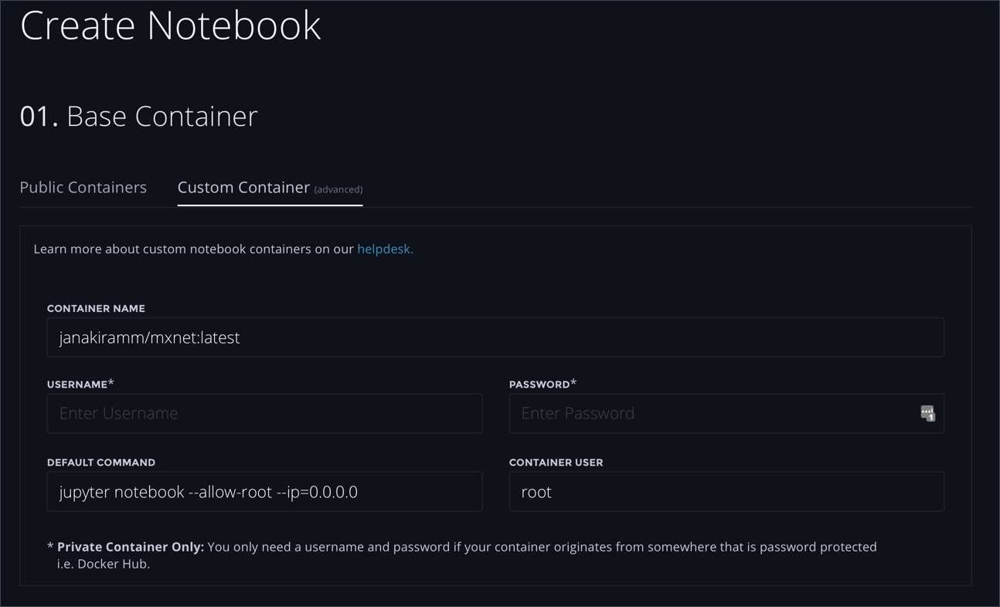
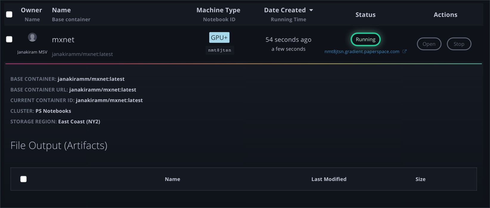
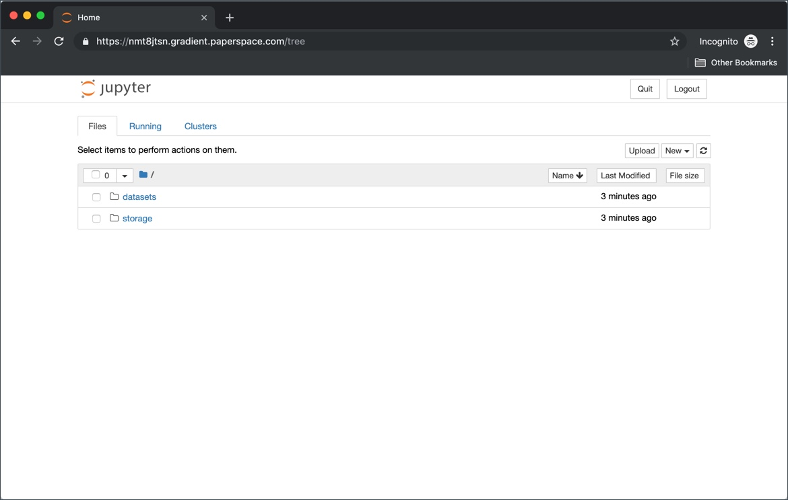
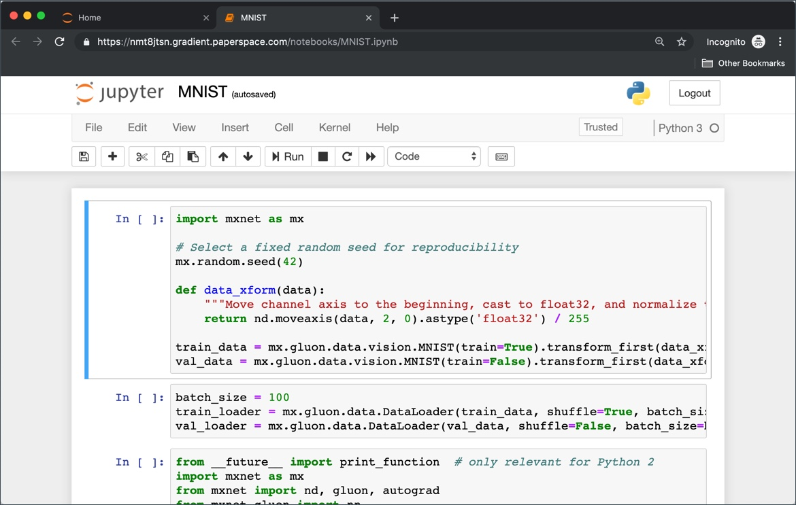

# Launch a Notebook from a Custom Container

## **Objectives**

* Build a custom container and push it to a registry
* Launch a Jupyter Notebook based on the custom container
* Train and test a model

## **Introduction**

The jobs submitted to Gradient run in the context of a container. Though the platform comes with mainstream container images, there may be a need to run a job within a custom container.

In this tutorial, we will learn how to build a custom container for training a model based on Apache MXNet. The container encapsulates all the dependencies needed for the job and Jupyter Notebooks for interactive development.

You may want to clone the [Github repository](https://github.com/janakiramm/mxnet-mnist) that has the Dockerfile and Jupyter Notebook.

## **Building a Custom Container**

Custom containers are Docker images that can be easily built on any machine that has Docker CE installed.

Make sure that Docker is running by executing the following command:

```bash
$ docker version
Client: Docker Engine - Community
 Version:           18.09.2
 API version:       1.39
 Go version:        go1.10.8
 Git commit:        6247962
 Built:             Sun Feb 10 04:12:39 2019
 OS/Arch:           darwin/amd64
 Experimental:      false

Server: Docker Engine - Community
 Engine:
  Version:          18.09.2
  API version:      1.39 (minimum version 1.12)
  Go version:       go1.10.6
  Git commit:       6247962
  Built:            Sun Feb 10 04:13:06 2019
  OS/Arch:          linux/amd64
  Experimental:     true

```

We will now create a Dockerfile that has the commands to install Apache MXNet and Jupyter Notebooks environment.

```bash
FROM mxnet/python:latest
RUN pip3 install requests
RUN pip3 install jupyterlab
RUN pip3 install matplotlib
```

The first line of Dockerfile instructs the build process to use mxnet/python as the base image. The next three lines simply use pip to install dependencies such as jupyterlab and matplotlib.

If you have cloned the Github Repo, Dockerfile is available in the Container directory.

Let’s go ahead and build the custom container. Replace the USERNAME environment variable with your Docker Hub username.

```bash
$ docker build -t $USERNAME/mxnet .
Sending build context to Docker daemon  2.048kB
Step 1/4 : FROM mxnet/python:latest
latest: Pulling from mxnet/python
7e6591854262: Pull complete
....
6a614067a2c4: Pull complete
107776115e90: Pull complete
Digest: sha256:628b8e5d6d375d595128e11c8088edae37534524aa1ca2c5086355c89a8d2649
Status: Downloaded newer image for mxnet/python:latest
 ---> 121567f56cd1
Step 2/4 : RUN pip3 install requests
 ---> Running in 0127fabe8f91
Requirement already satisfied: requests in /usr/local/lib/python3.5/dist-packages (2.21.0)
....
Removing intermediate container 0127fabe8f91
 ---> d839e172a78e
Step 3/4 : RUN pip3 install jupyterlab
 ---> Running in 7b9ddfe995a3
Collecting jupyterlab
  Downloading https://files.pythonhosted.org/packages/dd/7f/18b4ecfa055243f1eccdb1d7a1cdc0ae529f3df4c1098cee442ad177511a/jupyterlab-0.35.6-py3-none-any.whl (14.8MB)
Collecting jupyterlab-server<0.3.0,>=0.2.0 (from jupyterlab)
  Downloading https://files.pythonhosted.org/packages/78/77/e8a9c300afbe24aa46abaf1091d9e7b82328559e99cf2d601e858bcb3e1a/jupyterlab_server-0.2.0-py3-none-any.whl
...
Removing intermediate container 7b9ddfe995a3
 ---> 1bb94afa4112
Step 4/4 : RUN pip3 install matplotlib
 ---> Running in a57b4eaa39f6
Collecting matplotlib
  Downloading https://files.pythonhosted.org/packages/89/61/465fb3bfba684b0f53b5c4829c3c89e86e6fe9fdcdfda93e38f1788090f0/matplotlib-3.0.3-cp35-cp35m-manylinux1_x86_64.whl (13.0MB)
Collecting cycler>=0.10 (from matplotlib)
  Downloading https://files.pythonhosted.org/packages/f7/d2/e07d3ebb2bd7af696440ce7e754c59dd546ffe1bbe732c8ab68b9c834e61/cycler-0.10.0-py2.py3-none-any.whl
...
Removing intermediate container a57b4eaa39f6
 ---> d34a43f406cf
Successfully built d34a43f406cf
Successfully tagged janakiramm/mxnet:latest
```

We can verify the image creation by running docker images command.

```bash
$ docker images
REPOSITORY                                                 TAG        IMAGE ID CREATED SIZE
janakiramm/mxnet                                           latest        d34a43f406cf 2 minutes ago 742MB
mxnet/python                                               latest        121567f56cd1 6 days ago 551MB
```

Before we can access the custom container image from Gradient, we need to push it a container registry such as Docker Hub.

Login to Docker Hub, and then push the image.

```bash
$ docker login
Authenticating with existing credentials...
Login Succeeded
```

```bash
$ docker push $USERNAME/mxnet:latest
The push refers to repository [docker.io/janakiramm/mxnet]
8b622d1d381a: Pushed
4569983d4e90: Pushed
4af26e82c9e0: Pushed
5d5ab40659c9: Layer already exists
1bd27f114801: Layer already exists
f5ea869d942f: Layer already exists
26d13f8f529c: Layer already exists
d908c11b1a82: Layer already exists
7ccfaa7554e3: Layer already exists
89ec57aea3bf: Layer already exists
a0c1e01578b7: Layer already exists
latest: digest: sha256:8e525774d076a84935348539740418bf4726ce349685733d8787e49c990851e2 size: 2623
```

In the next step, we will launch a Jupyter Notebook based on the container image we just built.

## **Launching a Gradient Notebook Based on Custom Container**

Access the Notebooks from the left navigation bar of Gradient. Choose Custom Container to pull the Apache MXNet image that we built.



Under the container name, type the full container image name including the tag. If you are accessing a private registry, populate the username and password sections.

Provide the command that you would want to run along with the user context. These settings are highly dependent on the way the container is built. Since we didn’t include a default run command within the image, we are instructing Gradient to launch a Jupyter Notebook.

Follow the remaining steps involved in launching a Gradient Notebook. Refer to the Notebook tutorial for a step-by-step guide.

After the Notebook instance is launched successfully, click on the URL to access it.





You can upload the Notebook, `MNIST.ipynb`, cloned from the Github repo.



You can now train and test the CNN model based Lenet architecture trained with the popular MNIST dataset.

## Summary

Gradient is an ML PaaS that removes the friction involved in configuring pipelines for data science and machine learning. Similar to a PaaS, developers, and data scientists can upload data and code to Gradient to train sophisticated models. The scalable infrastructure of Gradient can be used for model serving.

The custom containers feature of Gradient allows developers to add additional runtimes, frameworks, and tools to the platform.

